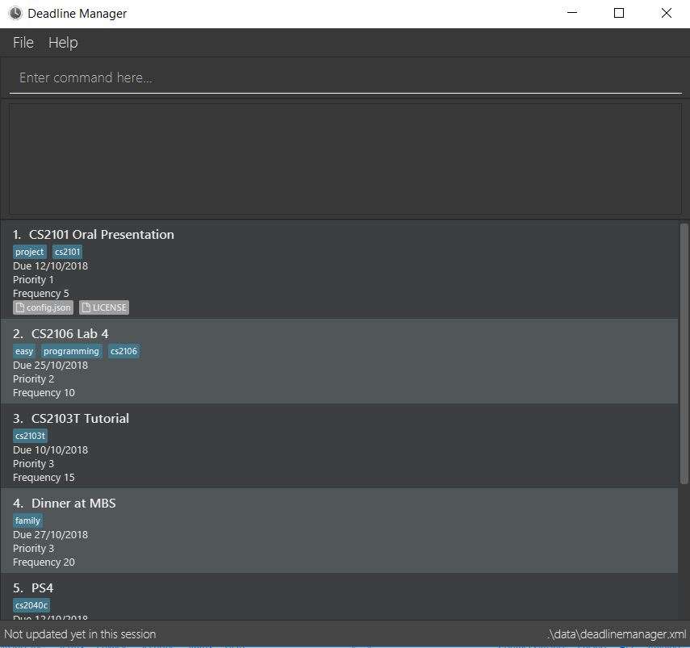

= Deadline Manager
ifdef::env-github,env-browser[:relfileprefix: docs/]

https://travis-ci.org/CS2103-AY1819S1-W17-4/main[image:https://travis-ci.org/CS2103-AY1819S1-W17-4/main.svg?branch=master[Build Status]]
https://ci.appveyor.com/project/Ranald/main/branch/master[image:https://ci.appveyor.com/api/projects/status/qu96yde2kpvqo7qy/branch/master?svg=true[Build status]]
https://coveralls.io/github/CS2103-AY1819S1-W17-4/main?branch=master[image:https://coveralls.io/repos/github/CS2103-AY1819S1-W17-4/main/badge.svg?branch=master[Coverage Status]]
////

https://www.codacy.com/app/damith/addressbook-level4?utm_source=github.com&utm_medium=referral&utm_content=se-edu/addressbook-level4&utm_campaign=Badge_Grade[image:https://api.codacy.com/project/badge/Grade/fc0b7775cf7f4fdeaf08776f3d8e364a[Codacy Badge]]
https://gitter.im/se-edu/Lobby[image:https://badges.gitter.im/se-edu/Lobby.svg[Gitter chat]]
////
ifdef::env-github[]

endif::[]

ifndef::env-github[]
image::images/Ui.png[width="600"]
endif::[]

* This is a desktop deadline manager application. It has a GUI but most of the user interactions happen using a CLI (Command Line Interface).
* It is designed for students in NUS School of Computing who can type fast and are comfortable with command line inputs. However, students from other faculties are welcome to use our deadline manager.
* Our main value proposition:
** Fully featured command line interface, allowing users to do what they need faster without needing to use the mouse.
** More features than regular deadline managers, such as the ability to snooze impending deadlines and procrastinate.
** Fully tested, including automated GUI testing.

== Site Map

* <<UserGuide#, User Guide>>
* <<DeveloperGuide#, Developer Guide>>
* <<AboutUs#, About Us>>
* <<ContactUs#, Contact Us>>

== Acknowledgements

* This application is based on https://github.com/nus-cs2103-AY1819S1/addressbook-level4[AddressBook Level 4].
* Some parts of this sample application were inspired by the excellent http://code.makery.ch/library/javafx-8-tutorial/[Java FX tutorial] by
_Marco Jakob_.
* Libraries used: https://github.com/TestFX/TestFX[TextFX], https://bitbucket.org/controlsfx/controlsfx/[ControlsFX], https://github.com/FasterXML/jackson[Jackson], https://github.com/google/guava[Guava], https://github.com/junit-team/junit5[JUnit5]

== Licence : link:LICENSE[MIT]
